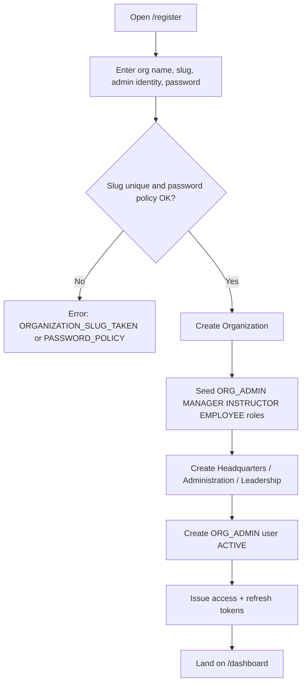
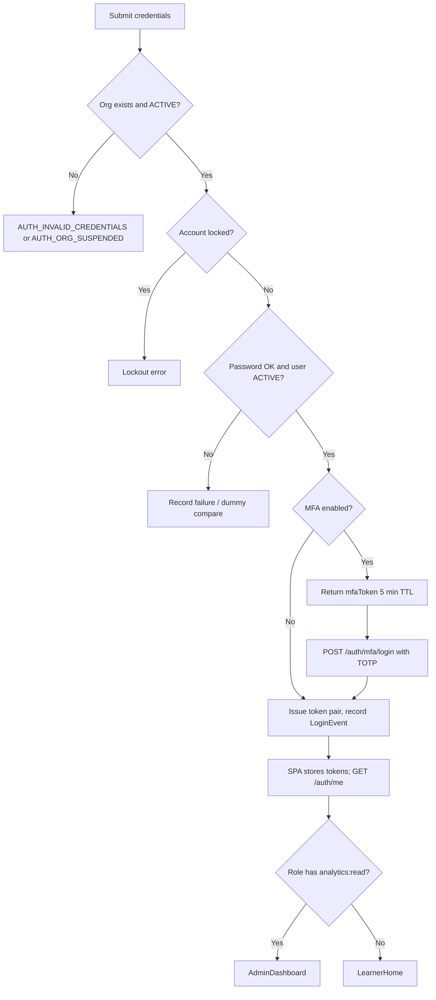
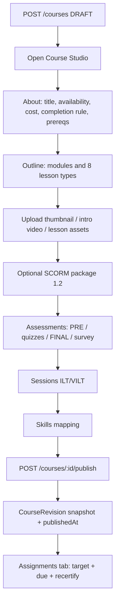
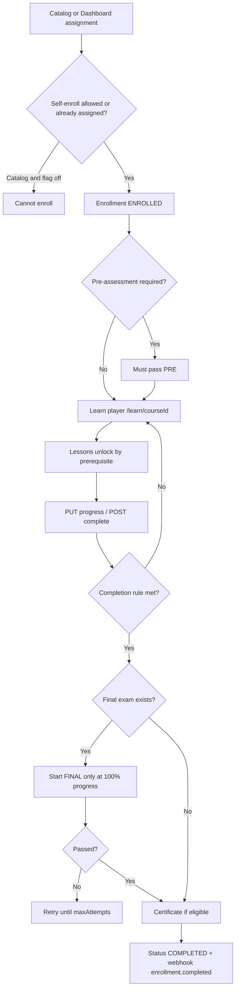
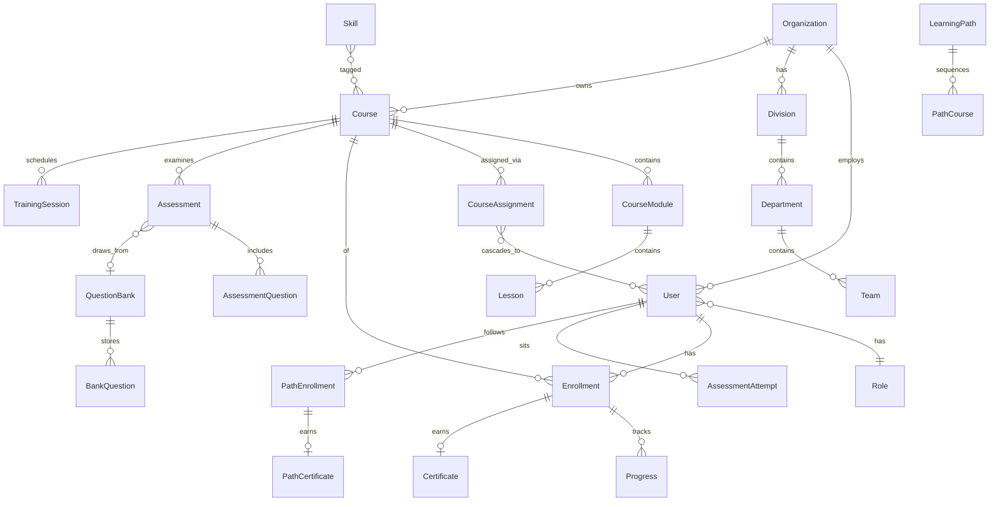

# Zynext TalentHub — Client Proposal Content Package

**Product:** Zynext TalentHub  
**Document type:** Client-ready proposal content for HTML presentation and PDF  
**Audience:** Executive buyers, L&D / HR leaders, IT / security reviewers  
**Status:** Grounded in the running product as of 1 September 2026  
**Classification:** Shipped capabilities unless marked *Incomplete* or *Constraint*

---

## Brand

The commercial name is **Zynext TalentHub**. Use this name on every client-facing surface: login, learner, admin, platform console, email, and this proposal. Do not present a second product name.

---

# 1. Executive summary

Zynext TalentHub is a **multi-tenant corporate learning management system** for organizations that must assign, deliver, prove, and report training across a real company structure — divisions, departments, and teams — not a flat class list.

It is built for **enterprises, training academies, and regulated teams** that need:

- Role-based access (learner, manager, instructor, organization admin, platform operator)
- Mandatory assignment with due dates and recertification
- Assessments that actually gate completion
- Certificates that can be verified by a third party
- Analytics and exportable reports for HR, L&D, and executives

The client receives a **complete web application**: a Next.js learner and admin experience, an Express API, and a PostgreSQL data model with tenant isolation on every organization-owned record.

### Selling points (grounded in the product)

1. **Org-aware learning, not classroom LMS.** Courses can be assigned to an entire organization, a division, a department, a team, or a single person. When people move in the org tree, enrollments can be reconciled. Managers only see their subtree.

2. **A real Course Studio.** Instructors and admins author modules and eight lesson types (video, reading, document, knowledge check, discussion, instructor-led, virtual ILT, SCORM 1.2), set completion rules, attach skills, schedule live sessions, version publish history, and assign with due dates — from one studio (`/courses/[id]`).

3. **Assessments that match corporate reality.** Four assessment kinds (pre, final, survey, module quiz), seven question types, question banks with tagged random draw, timed attempts, auto-grade plus an instructor **Grading queue** for essays and short answers, and a final exam that can block the certificate until passed.

4. **Proof of completion you can show an auditor.** Unique certificate numbers, branded templates (theme, logo, signature, background), public verification at `/verify/[number]`, expiry and recertification cycles, path-level certificates, and ZIP **compliance packages** (enrollments, overdue training, audit log).

5. **Executive reporting without a second BI tool.** Eleven analytics views (executive, learning, learners, organization, assessments, compliance, engagement, trends, skills, xAPI, ROI), seven operational reports with CSV / PDF / XLSX export, scheduled email reports, and API keys for BI pull.

---

# 2. Business problem and opportunity

## Typical pain this product is built to remove

| Pain | What happens today without a system like this | How Zynext TalentHub addresses it |
| --- | --- | --- |
| Training is assigned by spreadsheet | HR emails a list; nobody knows who finished | Assign to org / division / department / team / user; enrollment statuses ENROLLED → IN_PROGRESS → COMPLETED |
| Managers cannot see their people | Org-wide dashboards leak other departments | Manager data scope is the manager’s department subtree |
| Completion is a checkbox | Learners skip content; “done” is honor system | Completion modes: all lessons, required lessons, or a percentage; lesson prerequisites; optional pre-assessment gate; final exam at 100% progress |
| Certificates are Word templates | Easy to forge; no lookup | Globally unique certificate number, branded template, public verify page, revoke |
| Compliance training expires | People stay “certified” forever | Recertify-every-N-days on assignments; expiry notifications; recertify job re-opens the enrollment |
| Content lives in five tools | Video in Drive, quiz in Forms, SCORM in a player, classroom in calendar | Course Studio + SCORM 1.2 player + ILT/VILT sessions + assessments + community |
| Auditors want a pack | Weeks of export wrangling | Compliance package ZIP + audit logs + scheduled reports |
| Multi-company or multi-brand ops | One LMS install per company, or data bleed | Shared-database multi-tenancy; platform console for tenant lifecycle |

## Buyers and users (roles that exist in the system)

**Economic buyer / champion**

- **Organization Admin (`ORG_ADMIN`)** — owns the tenant: org tree, users, settings, SSO, certificates, integrations, reports.
- **Platform Admin (`SUPER_ADMIN`)** — operator of the SaaS: creates/suspends organizations. Lives in a separate `platform_admins` table, never as an org user.

**Day-to-day operators**

- **Manager (`MANAGER`)** — assigns training in their department, invites employees (employees only), reads subtree analytics.
- **Instructor (`INSTRUCTOR`)** — authors courses they created, publishes, grades, manages question banks, views analytics for their courses.

**End users**

- **Employee / learner (`EMPLOYEE`)** — catalog, learn player, quizzes, certificates, own reports, community.

There is **no custom role builder** in this version. The four org roles plus Super Admin are the complete role set.

---

# 3. Solution overview

## Positioning

**Zynext TalentHub is the operating system for corporate learning:** assign by org chart, deliver rich courses, examine competence, certify, and prove it — with tenant isolation suitable for a multi-organization rollout.

It is **not** a MOOC marketplace, not a K-12 SIS, and not a generic “upload a PDF and hope.” It is closer to a modern compliance + academy LMS: TalentLMS / Docebo-shaped problems, with a luxury admin shell (Linear-like navigation, Stripe-like KPI cards) rather than a Moodle-era UI.

## What the client gets

| Layer | What ships |
| --- | --- |
| Learner web app | Dashboard (“My learning”), Catalog, Learn player (`/learn/[courseId]`), Community, Certificates, Settings |
| Instructor / admin web app | Course Studio, Question banks, Grading queue, Enrollments, Organization tree, Users, Announcements, Analytics hub, Reports, Skills, Audit logs, Certificate template designer, Integrations |
| Platform console | `/platform` — organizations, tenant health KPIs, platform audit logs (Super Admin only) |
| Public surfaces | Self-serve org registration (`/register`), login / SSO / MFA, forgot/reset password, accept invite, **certificate verification** (`/verify/[number]`) |
| API | Versioned REST at `/api/v1`, OpenAPI at `/api/v1/docs/openapi.json`, API keys for BI report pull |
| Operations | Health (`/health`) and readiness (`/ready` checks the database), scheduled jobs via authenticated HTTP (`/api/v1/jobs/*`) |

**API base (production):** `{API_PUBLIC_URL}/api/v1`  
**Auth:** `Authorization: Bearer <accessToken>` plus rotating refresh tokens.

---

# 4. Target users and personas

## 4.1 Super Admin — Platform operator

**As a** platform operator, **I want** to create, inspect, suspend, and delete tenant organizations, **so that** the service can host many companies without mixing their data.

**Can do**

- Sign in at `/platform/login` (separate from org login).
- View platform overview: organization count, suspended count, total users, total courses.
- CRUD organizations (`GET/POST/PATCH/DELETE /api/v1/platform/organizations`).
- Read platform-wide audit logs (`/platform/audit-logs`).
- On org-scoped APIs, operate with `?organizationId=` (impersonation / support). That access is audited as `PLATFORM_TENANT_ACCESS`.

**Cannot / must not**

- Super Admin is **not** an `ORG_ADMIN` user inside a tenant. Platform identity is isolated.

## 4.2 Organization Admin — Tenant owner

**As an** organization admin, **I want** full control of structure, people, content policy, and proof, **so that** L&D can run without tickets to IT for every assignment.

**Can do (permission set includes 39 org permissions)**

- Org settings: name, timezone, self-enrollment flag, answer-reveal after quiz, training currency (USD or MMK), default course cost, certificate prefix and template, OIDC SSO.
- Drag-and-drop org tree: Organization → Division → Department → Team → User (`/organization`).
- Invite, import CSV, export CSV, suspend, activate, unlock lockouts, bulk status, resend invites.
- Full course, path, bank, grading, analytics, reports (including schedule and export), skills, audit, compliance export, API keys, webhooks.
- Revoke certificates.

**Cannot**

- Access another organization’s data.
- Create custom named roles (system roles only).

## 4.3 Manager — Department owner

**As a** manager, **I want** to assign training and see completion for *my* people, **so that** I am accountable for compliance without seeing the whole company.

**Can do**

- Read org tree (own subtree).
- Invite and administer **EMPLOYEE** users in subtree only — cannot create instructors or org admins.
- Assign courses to subtree targets; enroll/revoke in scope.
- Take courses (has `progress:write` and `assessment:submit`).
- Read analytics, compliance, reports (including export and schedule), skills, audit, xAPI.

**Cannot**

- Edit org tree, publish courses, write question banks, grade essays, write learning paths, revoke certificates, manage API keys/webhooks.
- Managers without a `departmentId` are rejected (`RBAC_SCOPE_MISSING`).

## 4.4 Instructor — Course author

**As an** instructor, **I want** to build and run courses, **so that** subject-matter experts can ship training without becoming org admins.

**Can do**

- Create/edit/publish courses they **created** (`createdByUserId === self`). Org admins can edit any course.
- Upload media, SCORM, assessments, sessions, question banks.
- Assign courses; read enrollments; grade attempts; read analytics, reports, skills, xAPI.
- Take courses themselves.

**Cannot**

- Mutate the org tree.
- Invite users or write org settings.
- Revoke certificates; schedule reports; manage integrations.

## 4.5 Employee — Learner

**As an** employee, **I want** a clear path: what is assigned, what is due, what to finish next, and my certificates, **so that** I can complete mandatory training without hunting for links.

**Can do**

- Dashboard: continue learning, assigned-not-started, due soon, my paths, recent certificates.
- Catalog (search, filters, favorites); self-enroll **only if** org setting `allowSelfEnrollment` is on.
- Learn player: outline, video/document/SCORM/quiz/discussion/ILT-VILT, progress, course forum.
- Submit assessments; view own certificates; own-only reports (`reports:read:own`).
- Community (org forum), announcements, notifications bell, profile/password/MFA/avatar.

**Cannot**

- See other learners’ PII, analytics, or admin nav items (nav is permission-filtered).

---

# 5. Feature catalog

For each module: **business value**, **key capabilities**, **constraints**. Status is **Shipped** unless noted.

---

### 5.1 Authentication and security — **Shipped**

**Business value:** Tenant-safe sign-in that IT can defend in a security review.

**Capabilities**

- Org login requires **email + password + organization slug** (`POST /api/v1/auth/login`). Same email can exist in two tenants.
- Platform login is a separate endpoint (`POST /api/v1/auth/platform/login`).
- JWT **access** (15 minutes) + **rotating refresh** (7 days) with token families and reuse detection.
- Password policy: 12–128 characters, letter + number, common-password blocklist, cannot contain email local-part or org slug. bcrypt cost ≥ 12 in production.
- Login lockout: 10 failures, dummy password compare to reduce user-enumeration timing.
- MFA (TOTP via otplib): setup, verify, disable, and `mfaRequired` login step (`POST /api/v1/auth/mfa/*`).
- Forgot / reset password (1-hour token). Invite accept (7-day token).
- OIDC SSO: discovery at `{issuer}/.well-known/openid-configuration`, `openid email profile`, domain allow-list, start at `GET /api/v1/auth/sso/:slug`.
- Rate limits: auth 5 / 15 min (prod), refresh 30 / 15 min, authenticated 600 / 15 min, global 300 / 15 min (prod), certificate verify 30 / minute.
- Helmet, CORS allowlist, HSTS in production, request IDs, no `X-Powered-By`.
- Soft-delete on orgs, users, courses. Suspended org or user cannot sign in.

**Constraints**

- Rate limiter is **in-memory** unless Redis is wired; production currently warns if `REDIS_URL` is unset.
- Mail in production **logs “mail_queued”** — SMTP env vars exist, but the mailer does not yet send via a real transport. Invites and resets depend on deploy-time mail being completed. *Incomplete.*
- Public self-registration creates a **new organization** (`/register`). Enterprise clients typically want this **disabled**. *Product decision Open.*

---

### 5.2 Multi-tenant / organization model — **Shipped**

**Business value:** One platform, many companies; no cross-tenant reads.

**Capabilities**

- Shared PostgreSQL; `organization_id` on tenant tables; repositories require org id.
- Org slug unique; settings JSON: timezone, `allowDivisionlessDepts`, `allowSelfEnrollment`, `certificatePrefix` (default `COR`), `showAnswersAfterAttempt`, certificate template, training currency, SSO.
- Org status `ACTIVE` | `SUSPENDED`; soft delete.
- Hierarchy: Division → Department (optional division) → Team → User placement.
- Drag-and-drop move (`PATCH /api/v1/org/move-node`) with enrollment reconcile (`MOVE_RECONCILE` source).
- Self-serve bootstrap on register: Headquarters division, Administration department, Leadership team, first user as `ORG_ADMIN`.

**Constraints**

- No per-org custom roles (`roles.organization_id` exists in schema; v1 seeds system roles only).
- Platform support access requires explicit `organizationId` query param.

---

### 5.3 Courses and curriculum (Course Studio) — **Shipped**

**Business value:** Authors ship structured programs without a second CMS.

**Studio tabs** (`/courses/[id]`): Outline, About, History (after first publish), SCORM, Assessments, Sessions, Assignments, Skills.

**Capabilities**

- Status: `DRAFT` → `PUBLISHED` → `ARCHIVED` (and unarchive).
- Modules (reorder) and lessons (reorder); uncategorized bucket supported.
- Course fields: title, description, thumbnail (1 MB), intro video (80 MB), duration, availability window (`availableFrom` / `availableUntil`), training cost, completion mode.
- Completion modes: `ALL_LESSONS`, `REQUIRED_LESSONS`, `PERCENTAGE` (+ `completionPercent`).
- Course prerequisites (acyclic). Optional `requirePreAssessment`.
- Duplicate course; force-delete query; publish writes a **Course Revision** snapshot.
- Catalog: search, pagination (24/page in UI), availability `open` | `upcoming` | `closed`, favorites.
- Self-enroll endpoint gated by org setting.

**Constraints**

- Instructors may only mutate courses they created.
- Assign only when status is `PUBLISHED` (`COURSE_NOT_PUBLISHED`).
- Availability errors: `COURSE_NOT_YET_AVAILABLE`, `COURSE_NO_LONGER_AVAILABLE`.

---

### 5.4 Lessons, content, and media — **Shipped**

**Business value:** Mix self-paced, live, and imported packaged content in one outline.

**Eight lesson kinds**

| Kind | UI label | Typical use |
| --- | --- | --- |
| `VIDEO` | Video | Lecture / clip with watch position |
| `READING` | Reading | Markdown / article |
| `DOCUMENT` | Document | PDF, slides, file (25 MB) |
| `QUIZ` | Knowledge check | Linked module quiz |
| `DISCUSSION` | Discussion | Prompt + course forum |
| `ILT` | Instructor-led | In-person session |
| `VILT` | Virtual ILT | Live online session |
| `SCORM` | SCORM | Imported SCORM **1.2** package (100 MB) |

**Capabilities**

- Lesson required flag; lesson-level prerequisite; duration seconds.
- Lesson asset upload (`POST /api/v1/lessons/:id/asset`, video up to 80 MB).
- Authenticated media API (`GET /api/v1/media/*`); raw `/uploads` is **403**.
- SCORM launch in learn player and instructor preview; CMI state stored on enrollment (`scormLessonStatus`, score, suspend_data, location, session_time).
- Training sessions: capacity, timezone, location or meeting URL, register, attendance (`REGISTERED` | `ATTENDED` | `NO_SHOW` | `CANCELLED`).

**Constraints**

- SCORM **1.2 only** (manifest parser returns version `1.2`). Not SCORM 2004 / xAPI packages as the SCO.
- Files live on **local disk**, not S3/presigned URLs (older spec mentioned S3; the running product does not).
- No transcoding or adaptive bitrate. *Constraint.*

---

### 5.5 Enrollments and progress — **Shipped**

**Business value:** Assignment at org-chart scale with due dates and honest progress.

**Capabilities**

- Assignment targets: `ORGANIZATION` | `DIVISION` | `DEPARTMENT` | `TEAM` | `USER`.
- Assignment options: `dueAt`, `recertifyEveryDays`, `reminderDaysBefore` (default 7).
- Enrollment status: `ENROLLED` | `IN_PROGRESS` | `COMPLETED` | `REVOKED`.
- Sources: `ASSIGNMENT` | `MANUAL` | `MOVE_RECONCILE` | `RECERTIFY` | `PATH`.
- Unique per org+user+course. Idempotency-Key required on assign and create enrollment (24-hour in-memory replay cache; chunk size 500).
- Progress per lesson: completed, percentage, positionSeconds, watchedSeconds.
- Learner home: continue learning, assigned not started, due soon.

**Constraints**

- Idempotency cache is **in-process memory**, not Redis — not durable across restarts or multiple API nodes. *Reliability gap for multi-instance deploys.*

---

### 5.6 Assessments and quizzes — **Shipped**

**Business value:** Test knowledge, gate certificates, collect anonymous feedback.

**Four kinds**

| Kind | Rule |
| --- | --- |
| `PRE` | At most one per course; can gate content (`requirePreAssessment`) |
| `FINAL` | At most one per course; learner may start only at 100% progress (`ENROLLMENT_NOT_READY`); passing attempt required for certificate if a final exists |
| `SURVEY` | Passing score 0, unlimited attempts, optional `anonymous` |
| `MODULE_QUIZ` | Tied to one lesson (`lessonId`); one quiz per lesson |

**Capabilities**

- Passing score default 70; max attempts default 3 (surveys unlimited).
- Timed attempts (`timeLimitSeconds`); expire path marks `EXPIRED`.
- Start → in-progress snapshot of questions (shuffled) → submit.
- Question bank draw: `bankId`, `drawCount`, `drawTags`.
- Survey CSV export for authors.
- Attempt review for staff; optional reveal of answers if `showAnswersAfterAttempt`.

**Constraints**

- PRE and FINAL uniqueness is per course (cannot have two finals).

---

### 5.7 Question banks — **Shipped**

**Business value:** Reuse items across courses; randomize high-stakes tests.

**Seven question types:** `MCQ`, `TRUE_FALSE`, `MULTI_SELECT`, `SHORT_ANSWER`, `FILL_BLANK`, `MATCHING`, `ESSAY`.

**Capabilities**

- Banks CRUD; questions with points, explanation, difficulty, tags, metadata.
- Fill-in-the-blank acceptable answers; matching pairs; essay min/max words.
- Permission `question-bank:write` (Org Admin + Instructor). Employees cannot browse banks.

---

### 5.8 Grading — **Shipped**

**Business value:** Mix auto-score with human judgment.

**Auto-graded:** MCQ, true/false, multi-select, fill-blank, matching.  
**Manual (`PENDING_REVIEW`):** short answer and essay.

**Capabilities**

- Grading queue UI (`/grading`) — `GET /api/v1/assessments/pending-review`.
- Grade attempt: score, feedback (`PATCH /api/v1/assessments/attempts/:attemptId/grade`).
- Statuses: `AUTO_GRADED` | `PENDING_REVIEW` | `GRADED` | `EXPIRED`.

---

### 5.9 Certificates — **Shipped**

**Business value:** Verifiable proof for regulators, customers, and employees.

**Capabilities**

- Auto-issue when progress is 100% **and** (if a final assessment exists) a passing attempt exists.
- Number format from org prefix + year; globally unique; retries on collision.
- Optional `expiresAt` from assignment `recertifyEveryDays`.
- Path certificates with prefix `{certificatePrefix}-PATH`.
- Template designer (`/certificates/template`): themes `midnight` | `ivory` | `slate`, fonts, alignment, logo/signature/background uploads, signatory, accent color.
- Public verify + PNG download. Revoke (`certificate:revoke`).
- Email notification on issue (subject to mail gap above).

**Constraints**

- One live certificate per course enrollment. Revoked row is replaced on re-issue.
- Verify endpoint is rate-limited (30/min).

---

### 5.10 Analytics and reporting — **Shipped**

**Business value:** One hub for executives, HR, and instructors — scoped by role.

**Analytics tabs (`/analytics`):** executive, learning, learners, organization, assessments, compliance, engagement, trends, skills, xAPI, ROI.

**API**

- `/analytics/dashboard`, `by-org-level`, `by-role`, `compliance`, `courses`, `learners`, `engagement`, `trends`, `roi`, `snapshots`, `assessments`, `users/:id`.

**Reports (`/reports`):** enrollments, completions, progress, assessments, certificates, overdue-training, activity — list + export CSV/PDF/XLSX. Schedules daily/weekly/monthly with recipient list.

**KPI examples on admin dashboard:** active learners, enrollments, completion rate, certificates.

**ROI:** uses course `costCents` / org default training cost and currency (USD or MMK).

**Constraints**

- Daily snapshots require the `analytics-snapshots` job to be scheduled.
- Learner report access is `reports:read:own` only.

---

### 5.11 Notifications and announcements — **Shipped**

**Notification kinds:** `DUE_REMINDER`, `OVERDUE`, `ASSIGNED`, `PATH_COURSE_UNLOCKED`, `RECERTIFY_REQUIRED`, `ANNOUNCEMENT`, `CERT_EXPIRING`, `CERT_EXPIRED`.

**Capabilities**

- In-app bell: list, unread count, mark read / read-all.
- Reminder job + cert-expiry job write notifications and attempt email.
- Announcements: org- or course-scoped, publish/expiry window, banner on catalog and learner home.
- Community / forums: org-wide and course threads, pin/lock, posts.

**Constraints**

- Email delivery is not a guaranteed production SMTP send today (see mail gap).
- Webhook event coverage is only `enrollment.completed` and `report.delivered`.

---

### 5.12 Learning paths — **Shipped**

**Business value:** Multi-course programs with ordered unlock and a path certificate.

**Capabilities**

- Draft / published / archived. Ordered courses, required flags.
- Assign by same org-chart targets as courses. Enroll; learner progress endpoint.
- Completing a course can unlock the next (`PATH_COURSE_UNLOCKED`) and issue a path certificate when complete.

---

### 5.13 Skills — **Shipped**

**Business value:** Connect courses to role competency (light skills graph, not a full TMS).

**Capabilities**

- Org skill catalog (code, name, category, levels 1–5).
- Map skills to courses and to **system roles**.
- User skill demonstration on completion; skills analytics tab.

**Constraints**

- Not a full job-architecture / 9-box talent module. No skill endorsements or external competency frameworks (SFIA, etc.).

---

### 5.14 Platform administration — **Shipped**

**Business value:** Operate Zynext TalentHub as a SaaS or shared service.

**Capabilities**

- Tenant CRUD and status. Platform audit log. Overview KPIs.
- Jobs (secret header `X-Job-Secret`): reminders, recertify, scheduled-reports, cert-expiry, analytics-snapshots. Optional `?organizationId=` or all tenants.

---

### 5.15 Integrations, xAPI, compliance export — **Shipped (narrow)**

**API keys:** hashed, prefix shown, scopes currently **`reports:read` only**; BI route `GET /api/v1/bi/reports/:type` with API-key auth.

**Webhooks:** URL + secret + events `enrollment.completed`, `report.delivered`.

**xAPI:** statements recorded internally (verb, activity, JSON); list + stats. This is **not** a full remote LRS (no TinCan POST from third-party content, no forwarding).

**Compliance packages:** ZIP of enrollments.csv, overdue-training.csv, audit-log.csv, manifest.json.

**OpenAPI:** `GET /api/v1/docs/openapi.json`.

---

### 5.16 Background jobs — **Shipped (trigger model is ops-owned)**

| Job | Purpose |
| --- | --- |
| `POST /api/v1/jobs/reminders` | Due / overdue reminders |
| `POST /api/v1/jobs/recertify` | Expire cert, invalidate passing attempts, re-enroll |
| `POST /api/v1/jobs/scheduled-reports` | Run due scheduled reports |
| `POST /api/v1/jobs/cert-expiry` | Expiring / expired certificate notices |
| `POST /api/v1/jobs/analytics-snapshots` | Daily metrics snapshot |

There is **no in-process cron or queue worker**. Production must call these with `X-Job-Secret` (cron, Kubernetes CronJob, or similar). Dev default secret is `dev-job-secret`.

---

### 5.17 AI / generative features — **Not in product**

There is **no** AI authoring, auto-question generation, chatbot tutor, or LLM grading. Course Studio is human-authored. Do not claim AI in sales materials.

---

# 6. System workflows

Each workflow: actors, trigger, steps, success, exceptions.

---

## 6.1 User registration (new organization)

**Actors:** Prospective org admin  
**Trigger:** Visit `/register`  
**Success:** Tenant + Headquarters structure + ORG_ADMIN session

**Exceptions:** Weak password; slug taken; rate limit (5 / 15 min).

**Open:** Whether public registration remains on for a given client (enterprise usually off; platform admin creates the org instead).

---

## 6.2 Login and session

**Actors:** Org user  
**Trigger:** `/login` with slug + email + password

**Refresh:** `POST /auth/refresh` rotates family; reuse of an old refresh revokes the family.  
**Logout:** `POST /auth/logout`.  
**Exceptions:** Suspended user (`AUTH_ACCOUNT_SUSPENDED`); INVITED users cannot login until accept-invite.

---

## 6.3 Password reset

**Actors:** Org user  
**Trigger:** `/forgot-password`

1. Submit email + organization slug.  
2. If user exists, one-time token (1 hour), email with reset URL.  
3. `/reset-password` sets new password (policy enforced).  

**Exceptions:** Unknown email should not confirm existence (timing still dummy-compared on login; forgot-password should stay enumeration-safe in copy). Token reuse / expiry.

---

## 6.4 Invitation and RBAC assignment

**Actors:** ORG_ADMIN or MANAGER (employees only)  
**Trigger:** Invite dialog or CSV import (`POST /api/v1/users`, `/users/import`)

1. Actor picks role from **assignable roles**: Org Admin may assign EMPLOYEE, MANAGER, INSTRUCTOR, ORG_ADMIN; Manager may assign EMPLOYEE only.  
2. User created `INVITED`; invite token 7 days; email “You're invited to {org} on Zynext TalentHub”.  
3. Invitee opens `/accept-invite`, sets password, becomes `ACTIVE`, signed in.  
4. Resend invite available. Unlock after lockout. Suspend / activate / deactivate / bulk-status.

**Exceptions:** Cannot administer a higher role; manager out of department scope; CSV validation errors.

---

## 6.5 Organization / tenant onboarding (platform)

**Actors:** Super Admin  
**Trigger:** `/platform/organizations` create

1. Platform login.  
2. Create org (name, slug, optional settings).  
3. Org appears ACTIVE; platform overview updates user/course counts.  
4. Client’s first admin is invited **inside** the tenant (or they use `/register` if left enabled).  
5. Optional: suspend org — all org logins fail with `AUTH_ORG_SUSPENDED`.

---

## 6.6 SSO (OIDC)

**Actors:** Org admin (configure), learner (use)  
**Trigger:** Settings SSO fields; learner clicks SSO on login

1. Admin sets issuer, client id/secret, email domains, enabled.  
2. Learner hits `GET /api/v1/auth/sso/:slug`.  
3. OIDC discovery; redirect to IdP (`openid email profile`).  
4. Callback → short-lived exchange token → `POST /auth/sso/exchange` → session.  
5. Domain must match allow-list.

**Exceptions:** Discovery fail; domain mismatch; `ssoError` query on `/login`.

---

## 6.7 Course creation → publish

**Actors:** Instructor or Org Admin  
**Trigger:** Create course from `/courses`

**Success:** Status `PUBLISHED`; catalog/assign eligible.  
**Exceptions:** Instructor editing someone else’s course forbidden; archive blocks edit; publish of empty course — *confirm empty-publish rule in UAT (Open)*.

---

## 6.8 Learner discovery → enroll → learn → complete

**Actors:** Employee (and Manager as learner)  
**Trigger:** Assignment, path, catalog self-enroll, or admin manual enroll

**Exceptions:** Revoked enrollment; lesson locked; SCORM package missing; session at capacity; due date overdue (still completable unless policy added — overdue is reporting/reminder, not a hard lock).

---

## 6.9 Assessment create → take → grade → results

**Actors:** Instructor/Admin author; Learner submit; Instructor/Admin grade

1. Author: `POST /courses/:courseId/assessments` with kind, items or bank draw.  
2. Learner: `POST /assessments/:id/start` (snapshot + optional expiry).  
3. Learner: `POST /assessments/:id/submit` answers.  
4. Auto-score objective items; essays/short-answer → `PENDING_REVIEW`.  
5. Grader: Grading queue → score + feedback → `GRADED`.  
6. Pass/fail vs `passingScore`; attempts listed; optional review.

**Exceptions:** Max attempts exceeded; timer expiry (`EXPIRED`, score 0); final before 100% progress; survey anonymity (no learner identity in export — confirm in UAT).

---

## 6.10 Certificate issuance

**Actors:** System (on completion), Org Admin (revoke), Public (verify)

1. Progress hits 100% and completion rule satisfied.  
2. If FINAL exists, require passing attempt.  
3. Issue number `{PREFIX}-{YEAR}-…`; set expiry if recertify window exists.  
4. Audit `CERTIFICATE_ISSUED`; notify; mail.  
5. Public `/verify/{number}` shows valid/revoked and allows PNG download.  
6. Revoke: `POST /certificates/:id/revoke`. Recertify job may delete live cert and reopen enrollment (`RECERTIFY`).

---

## 6.11 Instructor / admin analytics

**Actors:** Org Admin, Manager (subtree), Instructor (own courses)

1. Open `/analytics` (or dashboard KPIs).  
2. Choose tab + date range + org-level filters (division/department/team).  
3. Drill to learners / courses / assessments / compliance / ROI / xAPI.  
4. Jump to `/reports` for operational tables; export; optionally schedule.

**Exceptions:** Employee never sees this nav (no `analytics:read`).

---

## 6.12 Platform administration

**Actors:** Super Admin

1. `/platform/login` → `/platform`.  
2. Create/patch/suspend/delete orgs.  
3. Review platform audit.  
4. Ops schedules job HTTP calls with `X-Job-Secret`.

---

## 6.13 File / media upload

**Actors:** Course author, user (avatar), org admin (certificate assets)

| Asset | Limit | Route |
| --- | --- | --- |
| Avatar | 1 MB | `POST /auth/me/avatar` |
| Thumbnail | 1 MB | `POST /courses/:id/thumbnail` |
| Intro video | 80 MB | `POST /courses/:id/intro-video` |
| Lesson video | 80 MB | `POST /lessons/:id/asset` |
| Lesson document | 25 MB | same |
| SCORM zip | 100 MB | `POST /courses/:id/scorm` |
| Certificate images | ~2.5 MB JSON body | `POST /organizations/current/certificate-assets` |

**Success:** Stored under org-scoped upload paths; served only via authenticated media API (plus SCORM cookie/query token for iframe).  
**Exceptions:** `PAYLOAD_TOO_LARGE`; path traversal rejected; unauthenticated `/uploads` forbidden.

---

## 6.14 Learning path assignment

**Actors:** Path author (`learning-path:write`), assigner (`course:assign`), learner

1. Create path, attach ordered courses, publish.  
2. Assign to org-chart target (cascades path enrollments).  
3. First required course enrolls; later courses unlock on completion.  
4. Path certificate on completion of required courses.

---

## 6.15 Live session (ILT / VILT)

**Actors:** Instructor (create), learner (register), instructor (attendance)

1. Studio → Sessions: times, timezone, location or meeting URL, capacity, instructor.  
2. Enrolled learner registers.  
3. Instructor marks ATTENDED / NO_SHOW.  
4. Capacity full → registration rejected.

---

# 7. Information architecture

## 7.1 Primary navigation (permission-filtered)

**Learn / work**

| Area | Route | Typical roles |
| --- | --- | --- |
| Dashboard | `/dashboard` | All (admin vs learner home by `analytics:read`) |
| Catalog | `/catalog` | `course:read` |
| Community | `/community` | `course:read` |
| Courses | `/courses`, `/courses/[id]` studio | `course:read` / write |
| Learning paths | `/learning-paths` | `course:read` |
| Learn player | `/learn/[courseId]` | enrolled learner |

**Manage**

| Area | Route | Permission |
| --- | --- | --- |
| Organization | `/organization` | `org:read` or `org:tree:read` |
| Announcements | `/announcements` | `org:write` or `course:write` |
| Users | `/users` | `user:read` |
| Enrollments | `/enrollments` | `enrollment:read` |
| Question banks | `/question-banks` | `question-bank:write` |
| Grading queue | `/grading` | `assessment:grade` |
| Analytics | `/analytics` | `analytics:read` |
| Reports | `/reports`, `/reports/schedules` | `reports:read` or own |
| Skills | `/skills` | `skills:read` |
| Audit logs | `/settings/audit-logs` | `audit:read` |
| Certificates | `/certificates`, `/certificates/template` | `certificate:read` / `org:write` |

**Account:** `/settings`, `/settings/integrations` (`api-key:write` / `webhook:write`)

**Platform:** `/platform`, `/platform/organizations`, `/platform/audit-logs`

**Public auth:** `/login`, `/register`, `/forgot-password`, `/reset-password`, `/accept-invite`, `/platform/login`  
**Public trust:** `/verify/[number]`

## 7.2 Key entities and relationships

**Core nouns (use these terms consistently)**

- **Organization (tenant)** — customer workspace.  
- **Org tree** — Division / Department / Team.  
- **Assignment** — rule that a course or path applies to a target.  
- **Enrollment** — a person’s instance of a course.  
- **Progress** — per-lesson completion.  
- **Attempt** — one sitting of an assessment.  
- **Certificate** — issued proof, verifiable by number.

---

# 8. Security, compliance, and trust

## What to tell a client (business language, no exploit detail)

**Identity**

- Passwords are hashed (bcrypt, production cost 12+). Sessions use short-lived access tokens and rotating refresh tokens. Optional authenticator MFA. Optional company OIDC.

**Authorization**

- 43 named permissions in `{resource}:{action}` form. Four org roles plus Super Admin. Managers are confined to their department; instructors to courses they created for writes; employees to self.

**Tenant isolation**

- Every learner, course, and certificate belongs to one organization. Org users cannot switch tenant via query parameters. Platform access to a tenant is explicit and audited.

**Uploads**

- Files are not world-readable. Direct `/uploads` is blocked. Playback and downloads go through an authenticated media service that checks the caller’s right to that path.

**Audit and proof**

- Mutating actions write audit logs (actor, action, resource, request id, IP). Certificates are uniquely numbered and publicly verifiable. Compliance ZIP packages enrollments, overdue training, and audit CSV.

**Abuse controls**

- Login throttling and lockout. Separate burst limits on auth and certificate lookup. Idempotent assignment to reduce duplicate enrollments.

**Secrets**

- JWT secrets and refresh secrets must differ; env is validated at boot. API key secrets shown once. Webhook signing secrets shown once. Job endpoints require a shared job secret.

**Honest limits for the trust conversation**

- Not claimed: SOC 2, ISO 27001, GDPR DPA, HIPAA, or penetration-test report — none of these are evidenced in the product itself.  
- Observability in code is request IDs and structured-ish logs; **pino** appears in the spec, not in the running backend dependencies.  
- Email is not a hardened production mail pipeline yet.  
- Multi-node rate limit and enrollment idempotency need Redis (or equivalent) before a horizontally scaled production claim.

---

# 9. Non-functional qualities

## Performance and scale (as designed)

- Pagination default 25, max 100. Catalog UI 24 per page.  
- Enrollment cascade processed in chunks of 500 inside serializable transactions.  
- Analytics daily snapshots offload heavy dashboard history.  
- JSON body 1 MB; large media on dedicated raw upload routes.

**Not evidenced:** published concurrency numbers, CDN, object storage, or auto-scale tests. Treat capacity as **to be proven in a pilot** (users, concurrent video, SCORM).

## Reliability

- `/health` liveness (no DB). `/ready` DB `SELECT 1` with 2 s timeout.  
- Soft delete; typed API error envelope (`success`, `error.code`, `requestId`).  
- Jobs are **externally scheduled** — if cron is down, reminders and recertify do not run.

## Observability

- `X-Request-Id` (ULID-like or inbound).  
- Login events (method, IP, user agent).  
- Audit log UI for org and platform.  
- Gap: no APM, no pino dependency, no compression middleware in `app.ts` despite older spec.

## Tech stack (for a technical buyer)

| Layer | Technology |
| --- | --- |
| Web | Next.js 15, React 19, TypeScript, Tailwind, shadcn/Radix, TanStack Query, Framer Motion, Recharts, Geist font, next-themes (dark mode), @dnd-kit org tree |
| API | Node.js (target 22 LTS), Express 4, Zod validation, Prisma 6, JWT, otplib (MFA), PDFKit, ExcelJS, Helmet |
| Data | PostgreSQL 16 |
| Media | Local filesystem uploads + authenticated media route; SCORM 1.2 unzip + HTML player |
| Ops hooks | HTTP job endpoints, `/health`, `/ready`, OpenAPI JSON |

---

# 10. Implementation / engagement model

## Suggested rollout phases

### Phase 0 — Discovery (1–2 weeks)

- Confirm tenant branding / white-label needs (product name is Zynext TalentHub).  
- Decide: public `/register` on or off.  
- Identity: password-only vs MFA required vs OIDC.  
- Org tree design; who is ORG_ADMIN vs MANAGER.  
- Mandatory courses, finals, recertify intervals.  
- Success KPIs (section below).  
- Hosting: single region, backup, SMTP, cron, TLS, object storage plan.

### Phase 1 — Pilot (4–6 weeks)

- One organization, 1–2 departments, 50–200 learners.  
- 3–5 published courses (mix of video + quiz + one SCORM if needed).  
- One learning path; certificate template branded.  
- Manager assignment + due dates.  
- Weekly review of completion and overdue reports.  
- Wire MFA for admins; disable public register if enterprise.

### Phase 2 — Production (6–10 weeks)

- Full org tree import (CSV users).  
- SSO if required.  
- Job scheduler in the client’s environment.  
- SMTP (must be completed — current code path is not a full send).  
- Scheduled reports to HR mailbox.  
- Compliance package rehearsal with audit.  
- API key for BI if they have a warehouse.  
- Platform admin runbook if you host multi-tenant.

### Phase 3 — Scale and harden (ongoing)

- Redis (or equivalent) for rate limits and idempotency.  
- Object storage for media.  
- Horizontal API instances.  
- Expand webhook events / custom roles if sold as roadmap.  
- Load test video + SCORM.

## Out-of-the-box vs customization

| Out of the box | Typical customization (statement of work) |
| --- | --- |
| Four org roles + Super Admin | Custom roles / extra permissions |
| Certificate template designer | Legal seal, QR to a client domain, PDF print shop |
| USD / MMK training cost | Other currencies, procurement integration |
| OIDC SSO | SAML, SCIM provisioning |
| Local uploads | S3/Azure Blob, virus scan, transcoding |
| HTTP jobs | Managed worker + dashboards |
| UI copy / white-label | Full white-label beyond Zynext TalentHub |
| Reports CSV/PDF/XLSX | Client-specific statutory report |
| No LMS mobile app | Native apps (not in product) |
| No AI | Any generative feature |

## Success metrics / KPIs the client can track **in-product**

| KPI | Where |
| --- | --- |
| Active learners / total users | Dashboard, analytics executive |
| Enrollment count | Dashboard |
| Completion rate | Dashboard / analytics |
| Certificates issued | Dashboard / certificates report |
| Overdue training | Reports → overdue-training |
| Assessment pass rates | Analytics assessments |
| Engagement over time | Analytics engagement / trends |
| Training ROI vs course cost | Analytics ROI |
| Skill coverage vs role | Analytics skills |
| Login activity | Reports → activity; login events |
| Time to complete assigned training | Completions / progress reports |

**Pilot success (recommended, not product-enforced):** ≥ 90% of assigned learners enrolled; ≥ 80% completion of the flagship compliance course within the due window; zero cross-tenant data findings in a review; certificate verify demo to an auditor.

---

# 11. Competitive differentiators

Versus a generic Moodle or Canvas-style academic LMS:

1. **Company hierarchy is a first-class object** — not groups bolted on. Drag-and-drop tree, assignment cascade, manager subtree, move-reconcile.

2. **Two control planes:** org workspace vs **platform console** with isolated Super Admin identity. Built to sell or operate as multi-tenant SaaS.

3. **Completion is policy-driven** — required lessons, percentage rules, pre-test gates, final exam lock, recertification that actually invalidates the old pass.

4. **Certificate as a product** — branded designer, unique numbers, public verification URL, path certificates, expiry jobs — not a plugin afterthought.

5. **Operator-grade analytics pack** — 11 hubs including compliance, ROI (MMK/USD), skills, and xAPI *recording*, plus scheduled multi-format reports and a compliance ZIP.

6. **Modern authoring UX** — Course Studio tabs, eight lesson types including ILT/VILT attendance, SCORM 1.2 player, question bank draw, grading queue — in a luxury hybrid UI (Linear shell, Stripe-like KPIs), not a 2000s theme.

7. **Security posture visible in the IA** — slug-scoped login, MFA, OIDC, lockout, media ACL, audit, API keys hashed.

**Not a differentiator (do not oversell):** AI, mobile apps, SCORM 2004, full LRS, marketplace, social learning beyond forums, LTI 1.3 consumer, or a certified accessibility conformance report.

---

# 12. Risks, gaps, and honest limitations

A credible proposal states these before procurement does.

| Item | Severity | Notes |
| --- | --- | --- |
| Email not actually SMTP-sent | High for production | Invites, resets, cert mail, scheduled reports need a real transport. |
| Jobs not self-running | High | Client or host must cron `X-Job-Secret` endpoints. |
| In-memory rate limit + enrollment idempotency | High at scale | Unsafe across multiple API processes. |
| Local disk media | High at scale | No CDN/S3; backups and multi-instance sharing are a project. |
| Public org registration | Medium | Must be policy-controlled for enterprise. |
| No custom roles | Medium | Four roles only. |
| SCORM 1.2 only | Medium | Many vendor packages are 2004. |
| xAPI is internal store | Low–Medium | Not a replaceable LRS; limited verbs from our player. |
| Integrations thin | Medium | One API scope; two webhook events. |
| No AI | — | Roadmap only if sold separately. |
| Spec drift | Low | Docs mention pino, gzip, S3; code differs. Trust the running app. |
| MFA not mandatory | Medium | Policy is per-user opt-in. |
| Instructor cannot be created by managers | By design | Org Admin must provision instructors. |
| Certificate verify is unauthenticated | By design | Numbers are secrets in practice; rate-limited. |
| No published SLA, a11y audit, or compliance cert | High for some RFPs | Do not invent ISO/SOC claims. |
| Default training currency MMK | Positioning | Signals Myanmar/regional finance; confirm for other markets. |
| Frontend package `0.1.0` vs backend `1.0.0` | Low | Versioning not a commercial release process yet. |

**Incomplete vs older written spec (do not promise from BACKEND.md alone)**

- Presigned S3 uploads — **not shipped**.  
- pino-http / compression — **not in app.ts**.  
- “SCORM runtime not in v1” — **superseded**; 1.2 player **is shipped**.

---

# 13. Next steps / call to action

1. **Discovery workshop (half day)** — Org structure, mandatory curriculum, identity (SSO/MFA), branding, hosting, and whether self-registration stays on. Output: a one-page decision log.

2. **Pilot** — One tenant, real department, three courses, one path, certificate template, manager assignments, weekly overdue report. Success = completion KPI + auditor-style certificate verify.

3. **Production rollout** — User CSV/SSO, cron jobs, SMTP, backups, disable public register, platform runbook, optional BI API key.

4. **Commercial close** — Statement of work for gaps the client needs (object storage, Redis, SAML/SCIM, white-label, extra webhooks). Do not include those in “standard SaaS” until built.

**Immediate ask:** schedule the discovery workshop; provision a sandbox organization (platform create **or** `/register`); walk the Course Studio and certificate verify page live.

---

# 14. Appendix — Glossary (as used in Zynext TalentHub)

| Term | Meaning in this product |
| --- | --- |
| **Organization / tenant** | Isolated customer workspace (`organizations`). |
| **Slug** | Unique org login key (e.g. `acme`), required at sign-in. |
| **Platform Admin / Super Admin** | Operator in `platform_admins`; not an org user. |
| **ORG_ADMIN** | Full tenant administrator. |
| **MANAGER** | Department-scoped people manager. |
| **INSTRUCTOR** | Course author; writes courses they created. |
| **EMPLOYEE** | Learner. |
| **Org tree** | Division → Department → Team hierarchy. |
| **Course Studio** | Authoring UI at `/courses/[id]`. |
| **Module** | Week/section under a course. |
| **Lesson** | Unit of content; eight kinds. |
| **Assignment** | Targeting of a course or path to a node or person. |
| **Enrollment** | A user’s course instance. |
| **Progress** | Lesson-level completion and media position. |
| **Completion mode** | Rule to treat the course as complete. |
| **Catalog** | Discoverable published courses with availability windows. |
| **Self-enrollment** | Learner enroll without assignment; org setting. |
| **Assessment kind** | PRE, FINAL, SURVEY, MODULE_QUIZ. |
| **Question bank** | Reusable tagged item pool with random draw. |
| **Attempt** | One assessment sitting; may be timed. |
| **Grading queue** | Manual scoring of short answer/essay. |
| **Certificate number** | Globally unique id used on `/verify`. |
| **Recertify** | Time-based re-open of completed training. |
| **Learning path** | Ordered multi-course program. |
| **Path certificate** | Certificate for finishing a path. |
| **SCORM** | Sharable Content Object; **1.2** packages only. |
| **ILT / VILT** | In-person / virtual instructor-led sessions. |
| **xAPI statement** | Internally stored experience record. |
| **Compliance package** | Downloadable ZIP for auditors. |
| **API key** | Tenant key for BI report pull (`reports:read`). |
| **Job secret** | Header that authorizes scheduled maintenance jobs. |
| **Zynext TalentHub** | Product name used across the learner app, admin, platform console, email, and this proposal. |

---

# Presentation kit (for HTML + PDF)

## A. Recommended visual narrative (slide-like order)

Use this sequence for an “interested” 20–25 minute deck. Keep appendix workflows for the technical follow-up.

| # | Slide / section | Intent |
| --- | --- | --- |
| 1 | Title — Zynext TalentHub | One brand, one line: “Corporate learning that follows your org chart.” |
| 2 | The cost of informal training | Spreadsheet assignment, unverifiable certificates (section 2). |
| 3 | Who it is for | Five personas, one diagram. |
| 4 | Product in one picture | Learner / Studio / Proof / Platform. |
| 5 | Org tree demo still | Drag-and-drop + assign to department. |
| 6 | Course Studio | Eight lesson types + publish. |
| 7 | Learn player | Continue learning, due dates, SCORM/quiz. |
| 8 | Assessment + grading queue | Seven question types, final gates certificate. |
| 9 | Certificate + public verify | Trust moment — live URL. |
| 10 | Analytics hub | Executive KPIs + overdue report. |
| 11 | Security posture | MFA, SSO, tenant isolation, audit (no jargon dump). |
| 12 | Rollout | Discovery → Pilot → Production. |
| 13 | Honest scope | What is not included (AI, SCORM 2004, custom roles). |
| 14 | Next step | Workshop date + sandbox. |

Print PDF: slides 1–14. Leave workflows (section 6) as a technical appendix PDF.

## B. Color palette and brand tone

Derived from `frontend/src/app/globals.css` and auth/sidebar treatments.

| Token | Light | Dark | Use |
| --- | --- | --- | --- |
| Primary indigo | `hsl(239 84% 67%)` ≈ **#6366F1** | `hsl(239 84% 74%)` | Buttons, links, rings, logo tile |
| Ink / foreground | `hsl(224 71% 4%)` near-black blue | `hsl(210 20% 98%)` | Headlines |
| Muted | `hsl(220 9% 46%)` | `hsl(217 10% 65%)` | Subcopy |
| Canvas | White | `hsl(224 71% 4%)` | Page |
| Hero wash | Indigo 97% → violet 96% → gray 96% | Deep indigo/violet | Title slides, dashboard hero |
| Gradient accent | **#6366F1 → #818CF8** | same family | Borders, luxury cards (`shadow-luxury`) |
| Success | Emerald-500 (verify page) | — | Valid certificate |
| Danger | `hsl(0 84% 60%)` | darker red | Revoked, errors |
| Sidebar | `hsl(0 0% 98%)` | `hsl(224 47% 6%)` | Nav |

**Type:** Geist Sans + Geist Mono (UI). For print, pair a clean sans (Geist or Inter) with a serif only on certificate mockups.

**Tone:** Professional, calm, precise. Prefer “assign by department, prove with a numbered certificate” over “next-gen synergy.” Luxury = spacing and KPI cards, not ornament.

**Photography:** Real workplace / classroom; avoid stock “woman pointing at laptop hologram.” Prefer UI screenshots: Studio outline, learner home, verify page, analytics executive tab.

## C. One-line headlines (sales deck)

1. Training that follows your org chart — not a flat class list.  
2. Assign once to a department; enroll everyone who belongs there.  
3. Course Studio: video, documents, SCORM, live sessions, and exams in one outline.  
4. Completion is a rule, not a checkbox.  
5. Seven question types. A grading queue for the ones that need a human.  
6. Certificates with unique numbers the public can verify.  
7. Recertify on a clock — expired proof does not linger.  
8. Managers see their people. Nobody else.  
9. Eleven analytics views. Seven exportable reports. One compliance ZIP.  
10. Multi-tenant by design: many organizations, one platform operator.  
11. MFA, OIDC, lockout, and an audit trail — before the procurement questionnaire.  
12. From invite to issued certificate, without a second tool for quizzes or PDFs.

## D. Key metrics you can honestly claim

Use **product facts**, not invented customer counts (no live customer volume is in the repo).

| Claim | Number / fact |
| --- | --- |
| Org roles | **4** (ORG_ADMIN, MANAGER, INSTRUCTOR, EMPLOYEE) + **1** platform Super Admin |
| Named permissions | **43** |
| Assignment target types | **5** (organization, division, department, team, user) |
| Lesson types | **8** |
| Assessment kinds | **4** (pre, final, survey, module quiz) |
| Question types | **7** |
| Enrollment statuses | **4** |
| Completion modes | **3** |
| Analytics hub tabs | **11** |
| Operational report types | **7** |
| Export formats | **3** (CSV, PDF, XLSX) |
| Certificate themes | **3** (midnight, ivory, slate) |
| Notification kinds | **8** |
| Training currencies | **2** (USD, MMK) |
| SCORM | **1.2** (not 2004) |
| Access token lifetime | **15 minutes** |
| Refresh token lifetime | **7 days** |
| Invite lifetime | **7 days** |
| Password reset lifetime | **1 hour** |
| Minimum password length | **12** |
| Login failures before lockout | **10** |
| Default passing score | **70%** |
| Default max quiz attempts | **3** |
| Auth burst limit (prod) | **5 / 15 min** |
| Certificate verify limit | **30 / min** |
| Pagination max | **100** |
| Intro / lesson video cap | **80 MB** |
| Lesson document cap | **25 MB** |
| SCORM package cap | **100 MB** |
| Thumbnail / avatar cap | **1 MB** |
| Webhook events shipped | **2** |
| API key scopes shipped | **1** (`reports:read`) |
| Background job types | **5** |
| Frontend app routes (pages) | **35** page.tsx files |
| No AI features | **0** generative modules |

Do **not** claim: number of customers, uptime %, concurrent users, “SOC 2 certified,” or “used by X enterprises” — none are evidenced.

---

# Decisions and open questions

| ID | Topic | Assumption in this document | Status |
| --- | --- | --- | --- |
| D-1 | Commercial name | **Zynext TalentHub** on all client-facing surfaces | **Decided** |
| D-2 | Public `/register` | Call it optional; recommend off for enterprise | **Open** |
| D-3 | Hosting | Client or vendor-hosted; jobs and SMTP are client-ops | **Open** |
| D-4 | SMTP | Must be completed for production mail | **Gap** |
| D-5 | Object storage / Redis | Required before multi-instance claims | **Gap** |
| D-6 | Mandatory MFA | Not enforced; recommend policy in SOW | **Open** |
| D-7 | Empty course publish | Not verified as blocked | **Open** |
| D-8 | Survey anonymity guarantees | Flagged for UAT | **Open** |

---

# Handoff

**Engineering should not start net-new features for this proposal.** This package is content for HTML/PDF. If a slide needs a screenshot, capture: Course Studio outline tab, learner home, `/verify` success state, analytics executive tab, org tree.

**Blocked on product/marketing:** whether to show public registration, and any compliance certification claims.

**Docs created:** `docs/proposals/CLIENT_PROPOSAL.md`

**Build first after a signed pilot (suggested story order):** (1) SMTP actually sends, (2) cron jobs documented in a runbook, (3) disable-register flag if missing, (4) Redis for limits/idempotency, (5) object storage — none of these are requested in this BA pass.
